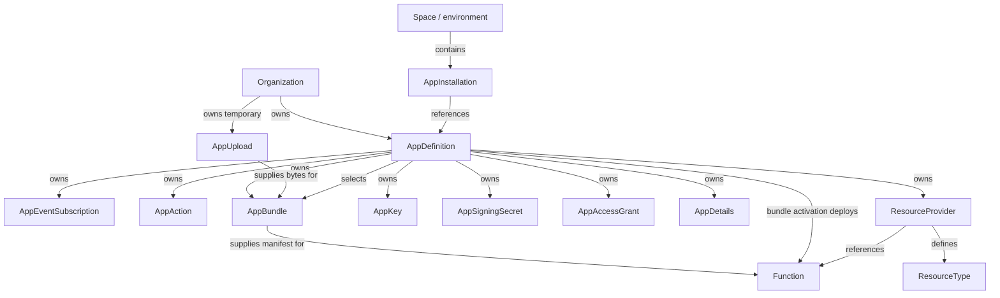
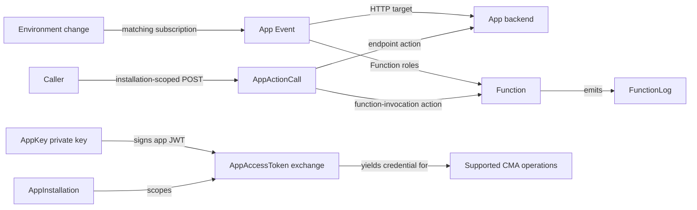

# App Framework resources, APIs, and behavior

The App Framework connects organization-owned app configuration with
space/environment installations, event delivery, action execution, deployment,
identity, and external resources. These concerns share references but have
different identities, data shapes, and lifecycles.

This study describes the Contentful resource model and its public API contracts.
It is a reference for understanding, operating, integrating, and maintaining
those contracts throughout their use and evolution.

- [Scope and evidence](#scope-and-evidence)
- [Resource relationships](#resource-relationships)
- [API inventory and shared conventions](#api-inventory)
- [AppEventSubscription and event data](#appeventsubscription-contract)
- [App Actions, categories, and calls](#app-actions-categories-and-calls)
- [App configuration and deployment](#app-configuration-and-deployment)
- [Signing, identity, and distribution](#signing-identity-and-distribution)
- [Native external references](#native-external-references)
- [Functions, logs, usage, and plan limits](#functions-logs-usage-and-plan-limits)
- [Traditional Webhooks and adjacent event products](#traditional-webhooks-and-other-event-products)
- [Identity, mutation, and concurrency](#identity-mutation-and-concurrency)
- [Unresolved behavior and source disagreements](#unresolved-behavior-and-source-disagreements)

## Scope and evidence

This research covers the public CMA resource families and first-party SDK
operations connected to event subscription, app execution, deployment,
identity, distribution, and observability. It does not assert that undocumented
internal APIs are absent, or inventory every CRUD operation for every entity
capable of emitting an event. Coverage follows each related family's addressing
scope, operations, request and response data, relationships, lifecycle behavior,
and operational limits. Source gaps remain explicit rather than being filled by
analogy to another resource.

| Evidence | What it establishes |
| --- | --- |
| Published Contentful documentation | The described service contract and availability, subject to the cited page and any recorded discrepancy. |
| Pinned first-party SDK/tooling | Declared data shapes, concrete paths, headers, and client behavior at that revision; permissive types do not prove server acceptance. |
| Direct observations | Outcomes for the exact tested requests on the observation date; they do not establish every permission, entitlement, or execution path. |
| Unresolved behavior | A limit on the evidence, not an API guarantee or an implementation prohibition. |

Primary documentation was checked on 2026-09-09. Source comparisons use:

- [contentful-management.js](https://github.com/contentful/contentful-management.js/tree/883e2b9dc1c76413d5c24e45f74243da699071e4), commit `883e2b9dc1c76413d5c24e45f74243da699071e4`.
- [node-apps-toolkit](https://github.com/contentful/node-apps-toolkit/tree/64fa31b6b2223cd1c8b1798fa540e8aad5e2d319), commit `64fa31b6b2223cd1c8b1798fa540e8aad5e2d319`.
- [create-contentful-app / app-scripts](https://github.com/contentful/create-contentful-app/tree/909e37a3e55a1e5851bdc35f49ac9c5c34b64d4e), commit `909e37a3e55a1e5851bdc35f49ac9c5c34b64d4e`.

Direct configuration observations were made on 2026-09-08 (UTC). Tenant
identifiers, credentials, names, inventory, usage, entitlement outcomes, region,
and local paths are omitted. Examples use synthetic IDs and reserved
`example.invalid` targets. Observation dates and public source revisions are
retained because a documentation edit does not refresh the underlying evidence.

The probes changed disposable, uninstalled configuration only. No content was
changed, app installed, HTTP event delivered, action invoked, or Function
executed. The retained results establish configuration behavior for the tested
requests, not end-to-end execution or availability for another tenant. Public plan
requirements below come from cited documentation; no tenant plan or entitlement
assessment is published here.

## Resource relationships

Ownership, deployment references, and runtime use are distinct relationships.
The following diagram shows structural scope; arrows are labeled so selecting
a bundle is not confused with owning a resource or installing an app.



| Resource family | Addressing and relationship | Lifecycle consequence |
| --- | --- | --- |
| AppDefinition | Organization-owned app with its own ID. | Its shared configuration can affect many installations. |
| AppInstallation | One app definition in one space/environment; addressed by that definition's ID. | Installation is environment configuration, not a copy of the definition. |
| AppEventSubscription, AppDetails, AppSigningSecret, ResourceProvider | Each has one optional singleton address below an app definition. | The parent tuple identifies the address; no collection operation exists for these singletons in the reviewed surface. |
| AppAction, AppBundle, AppKey, AppAccessGrant | Collections below an app definition, with action/bundle IDs, key fingerprints, or grant IDs. | Changing one member is distinct from changing the definition or all installations. |
| AppUpload | Organization-owned temporary artifact, outside the definition subtree. | Its expiry and deletion are separate from the durable bundle created from it. |
| Function | App-scoped runtime capability identified in the deployment manifest; visible through definition and installation routes. | Deployment materializes the Function; no independent create/update/delete Function endpoint is exposed. |
| ResourceType and Resource | Types are configured below ResourceProvider; external records are queried through an environment/type route. | A Resource response describes external content; it does not transfer ownership of that content to CMA. |
| AppActionCall and FunctionLog | Execution and diagnostic data addressed within an installation and action or Function. | These are runtime records, distinct from reusable configuration. |
| AppAccessToken and AppSignedRequest | Generated through an installation-scoped POST. | These yield credentials or headers, not another installed app or mutable configuration object. |

These relationships follow the endpoint and entity sources in the
[API inventory](#api-inventory) and the family-specific contracts below.
An app definition owns configuration shared across installations. Installation
selects the space/environment in which it operates. Subscription changes apply
to existing and future installations. AppInstallation events describe changes
to that app's own installation, not every app installed in the environment.
Sources: [App Events][events], [installation events][installation-events].

Execution connects those structural resources in different ways:



The signing secret authenticates outbound HTTP provenance; the AppKey/JWT
exchange establishes an app's CMA identity. Neither substitutes for the other.
See [Signing, identity, and distribution](#signing-identity-and-distribution).

## API inventory

Path abbreviations:

- `O = /organizations/{organizationId}`
- `A = O/app_definitions/{appDefinitionId}`
- `E = /spaces/{spaceId}/environments/{environmentId}`
- `I = E/app_installations/{appDefinitionId}`
- `W = /spaces/{spaceId}/webhook_definitions/{webhookId}`

Paths use the CMA host unless marked **upload host**. US hosts are
`api.contentful.com` and `upload.contentful.com`; regional configuration must
use the matching API/upload hosts. An installation is addressed using its app
definition ID within the environment.

| Resource or operation | Public methods and paths | Lifecycle / relevance |
| --- | --- | --- |
| AppDefinition | GET/POST `O/app_definitions`; GET/PUT/DELETE `A` | App metadata and selected frontend source/bundle. [SDK][definition-sdk] |
| Marketplace AppDefinition lookup | GET `/app_definitions?sys.id[in]=...` | Definition discovery; not a separate mutable app type. [Local client](../../internal/contentful-management-go/openapi/openapi.yml) |
| AppInstallation | GET `E/app_installations`; GET/PUT/DELETE `I` | PUT installs or reconfigures an app. [SDK][installation-sdk] |
| Cross-environment installation discovery | GET `/app_definitions/{appDefinitionId}/app_installations?sys.organization.sys.id[in]=...` | Lists installations of an app in an organization; supports space filters. [SDK][installation-sdk] |
| AppEventSubscription | GET/PUT/DELETE `A/event_subscription` | One subscription per definition; PUT upserts; no subscription ID or list operation. [SDK][event-sdk] |
| AppAction | GET/POST `A/actions`; GET/PUT/DELETE `A/actions/{actionId}` | Persistent endpoint or Function action definition. [SDK][action-sdk] |
| Environment action discovery | GET `E/actions`; SDK also supports `/spaces/{spaceId}/actions` | Available actions exposed by installed apps. [SDK][action-sdk] |
| AppActionCategory | GET `O/app_actions_categories` | Built-in parameter schemas, read-only. [CMA][categories] |
| AppActionCall | POST `I/actions/{actionId}/calls`; GET same plus `/{callId}` | Asynchronous execution and structured outcome. [SDK][call-sdk] |
| AppActionCall raw response | GET `I/actions/{actionId}/calls/{callId}/response` | Executor response, distinct from structured call result. [SDK][call-sdk] |
| Legacy call details | GET `E/actions/{actionId}/calls/{callId}` | Older SDK polling route, returns webhook-shaped details. [SDK][call-sdk] |
| AppDetails | GET/PUT/DELETE `A/details` | Optional singleton presentation metadata, currently an icon. [SDK][details-sdk] |
| AppUpload | POST `O/app_uploads`; GET/DELETE `O/app_uploads/{uploadId}` on **upload host** | Temporary zip upload. DELETE exists in SDK and succeeded live, although current CMA navigation omits it. [SDK][upload-sdk] |
| AppBundle | GET/POST `A/app_bundles`; GET/DELETE same plus `/{bundleId}` | Immutable deployment artifact; no update endpoint. [SDK][bundle-sdk] |
| Function | GET `A/functions`; GET same plus `/{functionId}`; GET `I/functions` | Created/deployed through bundles, not standalone Function CRUD. [SDK][function-sdk] |
| FunctionLog | GET `I/functions/{functionId}/logs`; GET same plus `/{logId}` | Generated execution records; cursor pagination and feature header. [SDK][log-sdk] |
| AppSigningSecret | GET/PUT/DELETE `A/signing_secret` | Symmetric signing secret singleton. [SDK][secret-sdk] |
| AppKey | GET/POST `A/keys`; GET/DELETE `A/keys/{fingerprint}` | Asymmetric app identity key; immutable, no update. [SDK][key-sdk] |
| AppAccessToken | POST `I/access_tokens` | Installation-scoped credential exchange, not durable CRUD. [SDK][token-sdk] |
| AppSignedRequest | POST `I/signed_requests` | Returns signature headers for a frontend request; does not deliver it. [SDK][signed-sdk] |
| AppAccessGrant | GET/POST `A/access_grants`; DELETE same plus `/{grantId}` | App distribution to other organizations; no update or singleton read established. [CMA][grants] |
| ResourceProvider | GET/PUT/DELETE `A/resource_provider` | Native external references singleton linked to a Function. [SDK][provider-sdk] |
| ResourceType | GET `A/resource_provider/resource_types`; GET/PUT/DELETE same plus `/{typeId}`; GET `E/resource_types` | Resource type identity and display mapping. [SDK][type-sdk] |
| Resource | GET `E/resource_types/{typeId}/resources` | External search/lookup, not management of the external objects. [SDK][resource-sdk] |
| Function usage | GET `O/usages/functions_invocations` | Aggregate usage rather than individual invocation logs. [CMA][usage-aggregate] |

Traditional Webhook resources and their observability endpoints are compared
separately below. No independent public CRUD resource named `AppAccess` was
identified; AppAccessGrant and AppAccessToken have distinct purposes.

### Transport, envelopes, and collection queries

CMA management requests use HTTPS and an access token. JSON mutation bodies use
`Content-Type: application/vnd.contentful.management.v1+json`; AppUpload sends
zip bytes instead. Management authorization, app-JWT exchange, outbound signing,
and access grants have separate roles; the [identity section](#signing-identity-and-distribution)
describes those boundaries. The CMA reports throttling with 429 and
`X-Contentful-RateLimit-Reset` in seconds. An observed rate or a published default
is not an app-specific quota. [CMA overview][cma-overview], [upload adapter][upload-sdk].

A Contentful link has `sys.type: "Link"`, `sys.linkType`, and `sys.id`;
the enclosing field determines the relationship. Response `sys` metadata is
resource-specific: an AppEventSubscription lacks its own `id` and `version`,
whereas AppDefinition includes both. Generic CMA statements about IDs or version
locking do not override those specific shapes.
[Subscription entity][event-entity], [definition entity][definition-entity].

| Collection surface | Query and response evidence |
| --- | --- |
| AppDefinition, AppInstallation, AppAction, AppBundle, AppKey and other offset collections | The SDK's `CollectionProp` contains `sys.type: "Array"`, `items`, `skip`, `limit`, and `total`. Query support is endpoint-specific; a shared SDK index signature is not proof that every search operator is accepted. [Shared types][common-types], [definition][definition-sdk], [installation][installation-sdk], [action][action-sdk], [bundle][bundle-sdk], [key][key-sdk]. |
| Cross-environment installations | Organization filter `sys.organization.sys.id[in]` plus optional `sys.space.sys.id[in]`; the SDK's `spaceId` query shorthand becomes the latter wire field. [Installation adapter][installation-sdk], [query conversion][query-utils]. |
| Function discovery | Definition and installation collections support `accepts[all]` in their declared query contract. [Function adapter][function-sdk]. |
| External Resource search/lookup | Cursor collection: `items`, `limit`, optional `pages.next`/`pages.prev`, without required `skip` or `total`; query details are in [Native external references](#native-external-references). [Resource adapter][resource-sdk], [shared types][common-types]. |
| FunctionLog | Declared request keys include `limit`, `pageNext`, and `pagePrev`, plus creation-time bounds. The adapter's generic offset-collection return annotation is not evidence that the log service uses offset pagination. Follow the dedicated log contract. [Log adapter][log-sdk], [log reference][logs]. |

The CMA also documents a general `cursor=true` mechanism. Its availability,
filter support, and pagination defaults must be taken from the endpoint in use.
SDK `select` normalization appends `sys` when its helper considers it absent;
this is client request rewriting, not server response behavior.
[CMA pagination][cma-overview], [query conversion][query-utils].

## AppEventSubscription contract

The SDK request consists of `topics: string[]`, optional `targetUrl: string`,
and optional `functions`, whose `filter`, `transformation`, and `handler`
members each contain a Function link. The response `sys` has organization and
app-definition links but no subscription `id` or `version`. The SDK does not
add a version header. [Entity][event-entity], [adapter][event-sdk].

The ordinary HTTP form exercised successfully was:

```json
{
  "targetUrl": "https://example.invalid/event-probe",
  "topics": ["Entry.publish"]
}
```

An illustrative response projection follows. IDs are synthetic; timestamps
and actor links are omitted. This shape comes from the documented entity type,
while the no-subscription-ID/no-version behavior was also observed directly.

```json
{
  "sys": {
    "type": "AppEventSubscription",
    "organization": {
      "sys": {"type": "Link", "linkType": "Organization", "id": "organization-id"}
    },
    "appDefinition": {
      "sys": {"type": "Link", "linkType": "AppDefinition", "id": "app-definition-id"}
    }
  },
  "targetUrl": "https://example.invalid/event-probe",
  "topics": ["Entry.publish"]
}
```

The Function form is documented independently of account entitlement:

```json
{
  "topics": ["Entry.publish"],
  "functions": {
    "handler": {
      "sys": {"type": "Link", "linkType": "Function", "id": "handler-id"}
    }
  }
}
```

A handler replaces the external HTTP target. A filter decides whether an event
continues, while a transformation alters the outgoing request before signing.
Their invocation types are `appevent.filter`, `appevent.transformation`, and
`appevent.handler`. They return, respectively, `{result: boolean}`, a
headers/body object, and no result. Function context supplies triggering
space/environment and installation parameters; the provided CMA identity has
that installation's scope. [Functions][functions], [toolkit types][function-types].

### Observed wire behavior

These are observed API results, not assumptions derived from local mock logic.

| Experiment | Result | Consequence |
| --- | --- | --- |
| Initial PUT / later PUT | 201 / 200 | Singleton upsert; submitted topics replaced prior topics. |
| PUT without version / with `X-Contentful-Version: 999999` | Both succeeded | No effective version check was demonstrated by this experiment. |
| Read response | No `sys.id` or `sys.version` | Identity comes from organization and app definition. |
| Successive replacements | Both `createdAt` and `updatedAt` changed | `createdAt` cannot be treated as stable original-creation evidence here. |
| Omitted `targetUrl` in HTTP form | 400, missing required property | Omission did not preserve the previous target. |
| Null / empty `targetUrl` | 422 type / regex error | Empty is not a usable target; validation reported `^https://.+`. |
| Omitted / null / empty `topics` | 422 | Required array, minimum one item. |
| Repeated topic | 422 uniqueness error | Duplicate topic strings are rejected. |
| `Entry.*` | 422 | Webhook wildcard syntax cannot be assumed for App Events. |
| Extra `filters: []`, `transformation: {}`, `unexpected: true` | 200, all three omitted in response | Acceptance does not establish support; no execution test checked their effect. |
| Nine Comment/Workflow/Task topics together | 200; identical topics on GET | Those exact arrays were accepted in the probe context. |
| DELETE / repeated DELETE | 204 / 404 | Deletion is not status-idempotent. |
| Delete definition with a subscription, then GET child | 204 / 404 | Child became inaccessible because the parent was absent; this does not inspect internal deletion storage. |

HTTP App Events do not expose the WebhookDefinition filter/transformation DSL,
custom method, multiple targets, basic-auth configuration, or a pause flag in
the reviewed request contract. The tested unknown-field behavior is particularly
important: ignoring a field is not implementation of that field.

### Event topics

The observed validation response to an invalid topic enumerated **88 allowed
strings**. Each action below is prefixed with its entity, for example
`Entry.publish`. This is an observed server allowlist, not a guarantee that the
organization is entitled to every underlying feature or that every event was
generated and delivered.

| Entity | Actions |
| --- | --- |
| Entry | create, delete, save, auto_save, publish, unpublish, archive, unarchive |
| Asset | create, delete, save, auto_save, publish, unpublish, archive, unarchive |
| ContentType | create, delete, save, publish, unpublish |
| AppInstallation | create, delete, save |
| Task | create, save, delete |
| Comment | create, delete, save |
| Release | create, save, archive, unarchive, delete |
| ReleaseAction | create, execute |
| ReleaseAsset | save, auto_save |
| ReleaseEntry | save, auto_save |
| ScheduledAction | create, save, execute, delete |
| BulkAction | create, execute |
| TemplateInstallation | complete |
| Workflow | create, save, complete |
| Experience | create, save, publish, unpublish, delete |
| Template | create, save, publish, unpublish, delete |
| ComponentType | create, save, publish, unpublish, delete |
| DataAssembly | create, save, publish, unpublish, delete |
| DesignToken | create, save, publish, unpublish, delete |
| View | create, save, publish, unpublish, delete |
| Fragment | create, save, publish, unpublish, archive, unarchive, delete |

The [CMA overview][event-reference] lists fewer topics and calls the installation
update event `AppInstallation.update`; the observed allowlist says
`AppInstallation.save`. Official changelogs separately document Workflow
create/save/complete and Comment create/delete, followed by Comment.save.
[Workflow/comment announcement][workflow-comments], [Comment.save][comment-save].

The toolkit's payload map is also incomplete: it lacks Comment.save and models
Workflow.delete where the observed allowlist and changelog use Workflow.complete.
Its entry-field typing is not a universal wire model of Contentful field values.
Do not turn that SDK type into a permanent closed server enum.
[Payload map][payload-types].

### Event data and contextual headers

Subscription topics use `Entity.action`; the delivered `X-Contentful-Topic`
header uses `ContentManagement.Entity.action`. A topic identifies both an
entity and an operation; its body is not uniformly a complete CMA entity.
[Function event types][function-types].

The pinned toolkit models Entry/Asset/ContentType delete and unpublish payloads
as `sys`-only records, with different metadata/content on create/save/publish.
It models Comment create/delete through `sys.newComment`/`sys.oldComment`, and
Task save through both `sys.oldTask` and `sys.newTask`. These distinctions explain
why one generic entity decoder is insufficient. They remain SDK declarations,
subject to the payload-map omissions and narrow field typing described above;
no delivery experiment establishes them as exhaustive wire schemas.
[Payload declarations][payload-types].

The published contextual headers for entry and asset publish/unpublish events
are:

| Header | Meaning |
| --- | --- |
| `x-contentful-bulk-action-id` | Triggering BulkAction `sys.id`. |
| `x-contentful-scheduled-action-id` | Triggering ScheduledAction `sys.id`. |
| `x-contentful-release-id` | Release `sys.id`. |
| `x-contentful-release-version-id` | Release `sys.version` used for the operation. |
| `x-contentful-release-action-id` | ReleaseAction `sys.id`. |

These are conditional context, not fields guaranteed on every event. The
announcement covers both App Events and webhooks.
[Contextual headers][context-headers].

## App Actions, categories, and calls

An AppAction defines a callable capability; AppActionCall records an execution.
There is no separate publish/activate lifecycle in the reviewed AppAction API.
The endpoint form used in the live probe was:

```json
{
  "name": "Example HTTP action",
  "category": "Custom",
  "parameters": [],
  "type": "endpoint",
  "url": "https://example.invalid/action-probe"
}
```

Current action forms are `endpoint` with HTTPS URL and `function-invocation`
with a `function: Link<Function>` accepting `appaction.call`; legacy
`type: function` is deprecated. The SDK create shape permits omitted `type` for
an endpoint and returns explicit `type: "endpoint"`; the default was also
observed directly. Built-in categories
include `Entries.v1.0` and `Notification.v1.0`. The live category endpoint
returned those two built-ins; their inputs describe entry IDs and notification
message/recipient respectively. [Action types][action-entity], [categories][categories].

The AppAction response carries the definition data and `sys.id`, plus
organization/app-definition links and timestamps/actors, without a `version`
in the SDK. AppActionCategory instead has `sys.id`, `sys.type`, a string-valued
`sys.version`, `name`, `description`, and optional parameter definitions. That
category version is not an AppAction concurrency token.
[Action and category entities][action-entity].

The current action guide supports `parametersSchema` and `resultSchema` using
JSON Schema draft 4. These validate invocation inputs and successful structured
results. The input contract is an alternative, not two independent optional
fields: direct observations accept a custom action with `parameters` or
`parametersSchema`, but reject both together. The pinned SDK's custom-category
intersection still requires `parameters` while allowing `parametersSchema`;
that type is not an accurate exclusive union for the observed service.
[App Actions guide][actions], [SDK type][action-entity].

Legacy parameter definitions require `id`, `name`, and `type`; the pinned
source types are Boolean, Symbol, Number, and Enum. Optional fields include
description, required, default, and options. AppAction parameters omit the
shared parameter type's `labels`; `Secret` belongs to installation parameters,
not this AppAction type. Type declarations do not establish null acceptance or
server defaults. [Shared parameter types][parameter-types].

The action adapter passes request fields directly, so construct a writable
body rather than sending response `sys`. Function actions use a raw `function`
link; the CLI's `functionId` is a manifest convenience converted before the
request. The SDK only declares caller-supplied `id` in its Function creation
branch, while the CLI carries it in both branches; chosen-ID support for every
action form is therefore not established. [Action adapter][action-sdk],
[CLI conversion][action-conversion].

The schema-based alternative exercised successfully was:

```json
{
  "name": "Schema action",
  "category": "Custom",
  "type": "endpoint",
  "url": "https://example.invalid/actions",
  "parametersSchema": {
    "type": "object",
    "properties": {"message": {"type": "string"}},
    "required": ["message"],
    "additionalProperties": false
  },
  "resultSchema": {"type": "object"}
}
```

| Observed request | Result and read-back evidence |
| --- | --- |
| Custom with `parameters: []`, no schema | POST 201; empty array retained. |
| Custom with only `parametersSchema` | POST 201; schema retained without a parameters array. |
| Both `parameters: []` and `parametersSchema` | 422 `ValidationFailed`: `AppAction cannot have both parametersSchema and parameters. Please provide just a parametersSchema.` |
| Custom with neither input definition | 422 `ValidationFailed`: `Please provide a parametersSchema to validate the app action call parameters`. |
| Schema-based action PUT omitting existing description/resultSchema | 200; both absent from the response and subsequent GET. |
| PUT switching schema-based input to `parameters: []` | 200; parametersSchema absent on subsequent GET. |
| Null description, URL, or either schema | 422 type validation errors; null was not an omission/clear operation. |
| `Entries.v1.0` with no parameters array | POST 201; response supplied its `entryIds` parameter definition. |

Schema object key order changed on GET; compare JSON structurally, not as raw
text. The observations do not cover every JSON Schema keyword, built-in/schema
combination, or result validation during execution. In particular, a built-in
category's returned parameters must not be mistaken for user-authored request
parameters without an explicit ownership decision.

Validation error decoding must also preserve structure: the observed AppAction
input-alternative errors use a string at `details.errors`, while null-field
type errors use an array of validation objects. Neither form should be lost
because a client assumes the other is universal.

Live endpoint-action create returned 201 both without and with a signing
secret. Update without a version header and GET returned 200; DELETE returned
204. This proves configuration access, not invocation behavior. The docs'
signing-secret requirement matters to execution: the call reference describes
409 for an absent/invalid provider signing secret, 403 for invalid calling-app
access, and 404 for absent action/provider installation. Older overview wording
restricts callers to app identities, while the current guide describes manual
user triggering; no caller-permission matrix was exercised here.
[Call reference][calls], [CMA App Actions][action-reference].

### AppActionCall request and outcome

An invocation sends `POST I/actions/{actionId}/calls` with a `parameters`
object. These are argument values, distinct from an AppAction's parameter
definitions or input schema. For the schema-based action above, a synthetic
request is:

```json
{"parameters": {"message": "Example"}}
```

The trigger reference documents 201 on submission; successful submission does
not establish successful execution. [Trigger endpoint][call-trigger].

The SDK call's `sys` contains its ID and links named `appDefinition`, `action`,
`space`, and `environment`, with no resource `version`. Structured outcome is
also inside `sys`:

| `sys.status` | Outcome data |
| --- | --- |
| `processing` | No terminal result is declared. |
| `succeeded` | `sys.result` is a JSON value: scalar, array, object, or null. |
| `failed` | `sys.error` has `sys: {type: "Error", id: string}` and `message`, with optional `details` and `statusCode`. |

A successful GET of a failed call is distinct from failure of the GET request.
Likewise, a null successful result is not an absent terminal outcome.
[Call entity][call-entity].

The `/response` route returns a `response` envelope with string `body` and
optional status/header data in the SDK. The SDK also declares an
`AppActionCallResponse` identity with links; the CMA example omits `sys` and
adds `method`/`url`. These are differing source representations, not a complete
wire schema validated here. Structured `sys.result`, raw `response.body`, and
legacy webhook-shaped call details are separate representations.
[Raw response entity][call-entity], [raw response reference][call-raw].

SDK `createWithResult` polls the installation-scoped route;
`createWithResponse` uses older call details. The default two-second interval
and 15 checks are SDK polling policy, not a service execution deadline.
[Polling implementation][call-sdk].

No call cancellation, deletion, replay, list endpoint, or retention guarantee
was established in the inspected AppActionCall contract. An execution ID should
not be treated as a configurable persistent action definition.

## App configuration and deployment

### AppDefinition and AppInstallation data

`Link<T>` below denotes `{sys: {type: "Link", linkType: T, id: "..."}}`.
The table describes pinned SDK shapes; optional declarations alone do not
establish null acceptance, clearing, or server defaults.

| Resource | Writable data | Returned identity and relationships |
| --- | --- | --- |
| AppDefinition | Required `name`; optional `src`, `locations`, `parameters`. Update can select `bundle: Link<AppBundle>`; the SDK create type excludes `bundle` and `sys`. | `sys.id`, organization link, `sys.shared`, and version/timestamp/actor metadata in the SDK. [Entity][definition-entity], [adapter][definition-sdk]. |
| AppInstallation | Optional `parameters` on PUT. These are installation values, distinct from the declarations on AppDefinition. | Definition, space, environment, and organization links; the SDK omits `sys.id` but retains version metadata. Addressing uses the app definition ID. [Entity][installation-entity]. |

AppDefinition locations include `app-config`, `entry-sidebar`, `entry-editor`,
`entry-field`, `dialog`, `page`, `home`, and `experience-toolbar` in the pinned
SDK. `entry-field` has `fieldTypes`; `page` can have
`navigationItem: {name, path}`. The `agent` location and `agent: {id}` property
are explicitly internal-only in that source, not established public app
capabilities. Instance and installation parameter declarations use `id`, `name`,
`type`, with optional description/required/default/options/labels. Installation
declarations additionally support `Secret`. [Definition entity][definition-entity],
[parameter types][parameter-types].

`src` points to an external frontend; `bundle` selects Contentful assets. The
definition reference permits both when the bundle contains only Functions.
Definition changes propagate to installations. The SDK's create/update type
difference does not independently prove whether POST can select a bundle.
[App definitions][definitions], [definition entity][definition-entity].

Installation parameter size and shape have conflicting source descriptions:
the CMA overview describes an object limited to **16 kB** after stringification;
the pinned SDK comment says **32 KB**, and its free-form type also permits
arrays and scalars. Neither the exact byte boundary nor non-object acceptance
was tested. Cloning an environment is documented to copy installations and
parameters. [App installations][installations], [installation entity][installation-entity],
[free-form type][parameter-types].

Cross-environment discovery has a special SDK response:
`{sys: {type: "Array"}, items: AppInstallation[], includes: {Environment: Environment[]}}`.
It does not declare the ordinary `total`/`skip`/`limit` fields. The adapter sends
`sys.organization.sys.id[in]` as a query parameter; the generated CMA example
places it in a header. This is a source discrepancy, not independent evidence
for two supported encodings. [Discovery type][definition-entity],
[adapter][installation-sdk], [endpoint example][installation-org].

Marketplace installation terms acceptance uses `X-Contentful-Marketplace` with
`i-accept-end-user-license-agreement,i-accept-marketplace-terms-of-service,i-accept-privacy-policy`
when the SDK's `acceptAllTerms` is true. Looking up a definition does not supply
that installation header. [Installation adapter][installation-sdk].

### AppDetails

AppDetails is a separate optional singleton. Its current `icon` shape is
`{type: "base64", value: "data:image/png;base64,..."}`; the reference describes PNG/JPG icons up to
128 by 128 pixels. An empty `{}` PUT succeeded with 201,
and deletion returned 204. The data-URI form is an upstream fixture, not proof
that bare base64 is rejected; icon clearing and normalization were not probed.
The SDK response adds organization/app-definition links and timestamps/actors
under `sys`, with no singleton id/version.
[Details reference][details], [entity][details-entity],
[upstream integration fixtures][details-tests].

### AppUpload, AppBundle, and activation

AppUpload accepts zip bytes with `Content-Type: application/octet-stream` on the
upload host. Its `sys.expiresAt` is authoritative; the reference describes a
temporary lifetime of roughly 24–48 hours. Uploading is distinct from creating
a bundle and selecting that bundle on an app definition. Its SDK response contains only
`sys`: upload ID, organization link, expiry and creation/update metadata, without
a version or archive bytes. [Uploads][uploads], [upload entity][upload-entity].

The hosting guide limits an upload to 10 MB and 500 files. Those limits come
from the hosting guide, not the generic asset limits or a bundle-count quota.
Whether the size bound concerns compressed or expanded data is not established.
[Hosting an app][hosting].

AppBundle creation takes `upload: Link<AppUpload>`, optional `comment`, and
Function manifests; the SDK additionally passes an older `actions` manifest
field with executable paths. That older shape is not the endpoint/Function-link
AppAction contract; current CLI action upsert is a separate operation.
The raw request uses `upload: {sys: {type: "Link", linkType: "AppUpload", id: "upload-id"}}`;
`appUploadId` is an SDK helper argument, not the corresponding JSON wire member.
Bundles have generated identity and file metadata, no update operation.
Frontend assets need root `index.html` and relative asset paths; functions-only
bundles do not need a frontend. [Bundle reference][bundles], [adapter][bundle-sdk],
[manifest types][bundle-entity].

The response exposes `files: [{name, size, md5}]`, optional comment/functions,
and `sys`; it does not promise an echoed upload link or legacy actions. GET
does not reconstruct zip/source bytes. An upload expires independently of the
durable bundle, so import and refresh must distinguish recoverable metadata
from local artifact inputs. Upstream tests reuse one upload for multiple
bundles; do not assume single-use consumption. [Bundle types][bundle-entity],
[integration tests][bundle-tests].

Upload POST/GET returned 201/200, and ordinary bundle creation returned 201.
These configuration results do not establish activation or runtime behavior.
Function deployment and execution contracts in this reference are sourced from
public documentation and tooling; they were not validated end to end.

A deployed Function read exposes `name`, `description`, `path`, `accepts`, and
optional `allowNetworks`. Its `sys` has the Function ID and organization/app
links, timestamps and actor links, with no version in the SDK. Installation
Function discovery returns the same app-owned projection; it does not describe
an independently configured environment Function. [Function entity][function-entity].

The specialized Function list query declares `accepts[all]`, not skip/limit,
although its response uses the generic collection type. The CMA list example
omits skip/limit and shows `accepts`/`allowNetworks` as strings, including
`appaction.event`; the SDK declares arrays and the toolkit uses `appaction.call`.
These example/type differences do not establish a validated wire union or
alternative invocation name. [Function adapter][function-sdk],
[Function example][function-list], [invocation types][function-types].

Function manifests identify `id`, `name`, `description`, `path`, `accepts`, and
optional outbound `allowNetworks`. Functions are managed through the bundle
deployment workflow; removing one from the manifest and deploying removes it,
and the guide warns that no Function history/backup is retained. A UI zip upload
alone does not create Functions. [Working with Functions][working-functions].

Raw SDK manifests require id/name/description/path and treat accepts/allowNetworks
as optional; the build tool imposes additional requirements. Source manifests
also contain build-only `entryFile`, which is removed before upload. CLI
defaults/network normalization are not raw API defaults.
[Bundle types][bundle-entity], [manifest conversion][manifest-conversion].

Activation is an AppDefinition update after upload and bundle creation. The
CLI reads the definition, assigns its bundle link, removes src when activating
a frontend, and submits the definition update. It handles a separate 400
`Function upload failed` error at this stage. Bundle creation success therefore
does not prove Function deployment success. The CLI also excludes the selected
bundle from cleanup; that policy is not evidence of a server rejection for
selected-bundle DELETE. [Activation implementation][activation],
[cleanup implementation][bundle-cleanup].

Frontend bundle promotion/rollback does not establish reliable historical
Function restoration. Selected-bundle deletion, old-bundle Function rollback,
omitted versus empty Function manifests, activation failure atomicity, and
effects on existing Function references need explicit integration evidence on
an entitled organization. A selected bundle link alone does not establish
deployment health or repair of references to removed Functions.

## Signing, identity, and distribution

### AppSigningSecret and AppSignedRequest

AppSigningSecret is a symmetric secret per app definition, exactly 64 characters
matching `^[0-9a-zA-Z+/=_-]+$`. PUT takes `{value: string}` and replaces it;
reads expose only the final four characters as `redactedValue`. Response `sys`
links organization/app definition, without id/version in the SDK.
[Entity][secret-entity].

Subsequent app events are signed. Rotation must coordinate backend acceptance of old/new secrets because Contentful stores one
at a time. [CMA secret contract][secret-reference].

The four-character suffix does not establish full-secret equality or allow
secret recovery. See the focused [App signing secret CMA contract](app-signing-secret.md)
for detailed read and replacement evidence.

AppSignedRequest accepts required method/path, optional string-valued headers,
and an optional string body. JSON must be serialized to those exact body bytes
before signing. Its SDK method union is GET/PUT/POST/DELETE/PATCH/HEAD; OPTIONS
acceptance is not established by that declaration. The path excludes scheme,
hostname, and port. [Request entity][signed-entity], [reference][signed-reference].

The result's `additionalHeaders` includes `x-contentful-signature`,
`x-contentful-signed-headers`, `x-contentful-timestamp`, and space/environment/user
ID headers. `sys` links definition, space, and environment, without id/version
in the SDK. Creating this result requires an installation and signing secret;
it does not deliver the HTTP request. Space users can request signatures, so
signed provenance does not replace backend authorization for the requested
operation. [Response entity][signed-entity], [reference][signed-reference].

Verification uses HMAC-SHA256 over the canonical method/path/selected headers
and exact body. The signature, signed-header list, timestamp, and applicable
space/environment/actor context must be checked together. The toolkit default
TTL is 30 seconds; zero disables age checking. Timestamp checking alone is not
persistent duplicate suppression. [Verification guide][verification],
[signer][signer], [verifier][verifier].

### AppKey and AppAccessToken

AppKey is asymmetric identity, not the symmetric event signing secret. The CMA
uses RSA/RS256 public JWKs (`kty: RSA`, `alg: RS256`, `use: sig`), permits up to
three keys per app, and does not allow sharing a key pair across apps. The API
can generate a key pair and return private material once, or accept a supplied
public JWK. There is no update endpoint; rotation is create, deploy, delete.
[App keys][keys].

Key creation sends `{generate: true}` or `{jwk: ...}`. Responses contain `jwk`
and, in generated mode, one-time `generated.privateKey` (described as base64
PEM by the SDK). `sys.id` is the key/fingerprint used in its URL; metadata links
the organization and app definition, without a version. The documented public
key representation uses base64 DER public-key bytes in `x5c[0]` and their
base64url SHA-256 fingerprint for both `kid` and `x5t`. This is the Contentful
representation described by its example, not a general JWK certificate-chain
normalization rule. [Key entity][key-entity], [key reference][keys].

AppAccessToken exchanges a signed app JWT for a token valid for 10 minutes and
scoped to one installation. The JWT identifies the AppDefinition through `iss`
and has standard `iat`/`exp` claims; the official toolkit uses `expiresIn: '10m'`.
Do not interpret ambiguous duration wording in the reference as literal
`exp: 600`. [Token reference][tokens], [token implementation][token-toolkit].

The SDK token helper takes `{jwt}`, but converts it to
`Authorization: Bearer <app JWT>` on a POST with **no request body**. The response
contains `token` and `sys.expiresAt`, plus definition/space/environment links;
the SDK omits id/version. This exchange is distinct from sending a management
access token to configure organization-owned resources.
[Token adapter][token-sdk], [token entity][token-entity].

Current identity documentation names Asset, ContentType, EditorInterface,
Entry, Locale, Release, ReleaseAction, ScheduledAction, Snapshot (master only),
Tag, Task, and the app's own AppInstallation. The token overview omits some
release/scheduling entities, so those permissions remain a documented
discrepancy rather than a tested matrix. Backend identities act independently
of a particular user's permissions; frontend operations on behalf of users
remain subject to user access. [App Identity][identity], [Framework overview][framework].

### AppAccessGrant

AccessGrant controls which organizations may install an app. It is app
distribution authorization, not a content-management token. Public sharing is
documented with `granteeType: "all"` and `granteeId: "all"`, returning
`sys.type: "AppAccessGrant"`. No grants were created during this research.
[Access Grant concept][grant-concept], [create reference][grant-create].

The public create reference exposes a permissive map and an all/all example;
the inspected sources do not establish the exact targeted-organization enum
or what revocation does to existing installations. Those
details limit what this evidence establishes about targeted grants and revocation. There
is no AccessGrant entity/adapter in the pinned management SDK; the public CMA
reference is the source for its endpoint family.

The published technical limit is 1,000 access grants per app definition. A
collection example's pagination limit must not be confused with that quota.
[Technical limits][limits].

`AppDefinition.sys.shared` is response metadata, not a writable definition
property in the SDK. Its exact derivation from grants was not established.
Sharing by a grant/link is separate from Marketplace submission and review;
installing a shared app links the existing definition rather than transferring
ownership or creating an owned copy. [Definition entity](https://github.com/contentful/contentful-management.js/blob/883e2b9dc1c76413d5c24e45f74243da699071e4/lib/entities/app-definition.ts),
[Marketplace publication](https://www.contentful.com/developers/docs/extensibility/app-framework/publishing-an-app/),
[sharing announcement](https://www.contentful.com/developers/changelog/app-sharing-easy-app-installation-outside-the-contentful-marketplace/).

## Native external references

ResourceProvider, ResourceType, and Resource connect an app's Function to
external content. Configuration, environment discovery, external resolution,
and delivery each expose different data.

| Resource | Request and response data | Identity and behavior |
| --- | --- | --- |
| ResourceProvider | PUT body requires `sys: {id}`, `type: "function"`, and `function: Link<Function>`. Response adds metadata and organization/definition links, without SDK version. | A parent-addressed singleton **with its own provider ID**. Its writable `sys.id` is an explicit exception to ordinary body projections. [Entity][provider-entity], [adapter][provider-sdk]. |
| ResourceType | PUT body contains `name` and `defaultFieldMapping`, without `sys`; response adds ID and provider/definition/organization links. | Addressed by resourceTypeId; documented IDs have `{Provider}:{Type}` form. The full configuration projection has no SDK version. [Entity][type-entity], [adapter][type-sdk], [concept][resource-entities]. |
| Environment ResourceType | Collection items expose `name` and `sys`, not `defaultFieldMapping` in the SDK. Some metadata is optional for system types such as `Contentful:Entry`. | This reduced discovery projection cannot reconstruct the full app-owned mapping. [Entity][type-entity], [endpoint][environment-types]. |
| Resource | GET selects search through `query` or lookup through string-valued `sys.urn[in]`; optional locale, referencingEntryId, limit, pageNext/pagePrev. Returns `sys.type: "Resource"`, `sys.urn`, related type/provider/definition links, and mapped `fields`. | URN identity, not a CMA-managed object ID/version; cursor pagination rather than an ordinary offset collection. These are resolved external records, not create/update requests to the external system. [Entity][resource-entity], [adapter][resource-sdk]. |

`defaultFieldMapping.title` is required; subtitle, description, externalUrl,
image, and badge are optional. Image has a URL and optional altText; badge has
label and variant. These are templates mapping external data to display fields,
not a universal schema of the external object. Response badge variants are
primary/negative/positive/warning/secondary in the SDK, while the mapping's
variant is a string template. [Mapping type][type-entity], [Resource type][resource-entity].

The pinned ResourceType environment-list adapter accepts cursor options in
its signature but does **not** forward them to the HTTP request. The public
reference illustrates a cursor response without listing query parameters.
This is an SDK forwarding gap, not proof that the service ignores cursors;
exhaustive environment discovery through that helper remains unverified.
[Adapter][type-sdk], [endpoint][environment-types].

| Function invocation | Pinned toolkit event and response shape |
| --- | --- |
| `resources.search` | Event contains resourceType and limit, optional query/locale/referencingEntryId/pages.nextCursor. Returns external-object `items` and `pages: {nextCursor?}`. |
| `resources.lookup` | Event contains resourceType, lookupBy (a map of scalar arrays), limit, and optional locale/referencingEntryId/cursor context. Returns the same items/pages shape. |
| `graphql.resourcetype.mapping` | Event supplies `resourceTypes: [{resourceTypeId}]`; response wraps mappings containing resourceTypeId, graphQLQueryField, graphQLQueryArguments, and optional graphQLOutputType. |
| `graphql.query` | Event has query, isIntrospectionQuery, variables, optional operationName. Response permits data (including null), errors, and extensions. |

The `resources.search`/`resources.lookup` responses carry external data before
the CMA display projection; GraphQL responses instead define mappings or resolve
delivery queries. The external cursor `pages.nextCursor` and CMA collection
links `pages.next` are different protocol layers. Sources: [resource invocation types][resource-function-types],
[GraphQL types][function-types]. The concept guide disagrees with itself about
whether lookup limit is optional; the toolkit requires it. No live evidence
resolves missing URNs, partial results/errors, ordering, or external paging.
[Resource Entities][resource-entities].

Custom external references additionally use `graphql.field.mapping`. Delivery
lookup can batch URNs; CDA/CPA requests omit the Entry editor request's
`referencingEntryId`. Native external references are documented for Premium and above. They are not
dependencies of an ordinary HTTP AppEventSubscription.
[Resource Entities][resource-entities], [native references availability][native-references].

## Functions, logs, usage, and plan limits

The Free plan's published limits are 10 app definitions per organization and
10 installations per environment. The older Extensibility FAQ's undifferentiated
250/50 limits should not override the explicit current Free rows.
[Technical limits][limits].

Functions are documented as Premium/Partner functionality. Premium includes
5 million executions/month and Enterprise 10 million/month in the usage table.
Marketplace Function executions are excluded from Function quota/overage
accounting; that exception does not enable custom Function deployment on Free.
[Function availability][working-functions], [usage limits][usage-limits].

Published Function technical ceilings are 50 Functions/app, 20 million
executions/organization/month, 128 MB memory, 20 outbound requests, 30 seconds
wall time and 10 seconds CPU. The limits page specifies a 10-second exception
using `resource.*` and one-second CPU for `graphql.*`; its spelling differs from
the actual `resources.*` invocation names. Logs are retained 30 days. Technical
ceilings are not included-plan quotas. [Technical limits][limits].

The runtime is not complete Node.js and has no filesystem. Event payloads and
the built-in CMA client's request/response data must be below 32 MB. Resource
limit or timeout termination is documented as not retried. That says nothing
about ordinary external HTTP App Event retries. [Runtime contract][functions].

### Function invocation context and logs

A Function handler receives `(event, context)`. For App Events, `event` contains
`type`, `headers`, and the topic-dependent `body`. App Actions use
`type: "appaction.call"` with headers and a parameter body; this is different
from the CMA invocation request's `parameters` wrapper. Context includes
`spaceId`, `environmentId`, and `appInstallationParameters`, with optional
`cmaClientOptions`, `cma`, and `originalRequest.headers` in the toolkit.
[Function types][function-types].

The Function guide supplies CMA client options for management contexts such as
App Events, App Actions, and external-resource search/lookup. It does not promise
CMA credentials in GraphQL delivery contexts. The supplied identity is scoped
to the containing app's triggering space/environment; it does not authorize
cross-space mutation. [Function CMA access][functions].

FunctionLog list/detail requests send
`x-contentful-enable-alpha-feature: function-logs` in the pinned SDK. List
parameters include `limit`, `pageNext` or `pagePrev`, and
`sys.createdAt[gt]`, `[gte]`, `[lt]`, or `[lte]`. The SDK's cursor and interval
unions reject both cursor directions or competing bounds. Its type composition
also inherits `accepts[all]`; the dedicated FunctionLog reference does not
establish that filter's server behavior. [Log adapter][log-sdk],
[query types][common-types].

The SDK record exposes `requestId`, event data, severity counters
(`info`, `warn`, `error`), and messages containing timestamp, type
(`INFO`, `WARN`, `ERROR`), and text. `sys` identifies the log and links its
space/environment/app definition. The public CMA example instead separates
`eventType` from `event: {headers, body}`, and represents message timestamps and
severity counts as strings where the SDK declares numbers. The SDK's event
type is GraphQL-shaped. These source disagreements have not been resolved by
an execution/log-reading experiment. The public list example is only `{}`;
it does not establish a complete collection envelope.
[Log entity][log-entity], [log detail][log-detail], [log list][log-list].

### Usage and observability

Aggregate Function usage requires inclusive `date[gte]` and `date[lte]`
YYYY-MM-DD parameters. `P1D` granularity supports up to 31 days per query;
`P1M` supports up to 12 months. A query without required dates returned 422.
Tenant usage results are excluded from this reference. [Aggregated usage][usage-aggregate].

The general Usage overview describes Free admin/owner access with 45-day
history, whereas newer aggregate documentation describes 12-month retention.
No older-history query was used to resolve that distinction. Old periodic
usage methods are deprecated in the SDK with a 2027-02-28 sunset.
[Usage overview][usage], [usage types][usage-entity].

Enterprise Observability streams CDA, GraphQL, and audit logs to external
storage. It requires Enterprise and organization admin/owner access. Its export
delivery status is not AppEventSubscription delivery health.
[Enterprise Observability][observability].

## Traditional Webhooks and other event products

WebhookDefinition is space-scoped, has its own ID, and needs no app
installation. It supports headers and secret headers, basic auth, filters,
transformations, `active: false`, and wildcard topics such as `*.*`, `Entry.*`,
and `*.save`. Those are different contracts from AppEventSubscription's
parent-keyed HTTP target and exact topics. A wildcard may include future event
types. [Webhook entity][webhook-entity], [filters][webhook-filters].

| Resource / operation | Methods and paths |
| --- | --- |
| WebhookDefinition collection | GET/POST `/spaces/{spaceId}/webhook_definitions` |
| Definition read / specified-ID create / update / delete | GET/PUT/DELETE `W` |
| Call summaries | GET `/spaces/{spaceId}/webhooks/{webhookId}/calls` |
| Call detail | GET `/spaces/{spaceId}/webhooks/{webhookId}/calls/{callId}` |
| Health | GET `/spaces/{spaceId}/webhooks/{webhookId}/health` |
| WebhookSigningSecret | GET/PUT/DELETE `/spaces/{spaceId}/webhook_settings/signing_secret` |

Definition paths use `webhook_definitions`; observability paths use `webhooks`.
The SDK sends `X-Contentful-Version` for updates. The signing secret is one
space-level setting affecting **all webhooks in that space**, unlike an
AppSigningSecret's one-definition scope. Its PUT takes `value`; reads return
`redactedValue`. It was not changed during the experiments.
[Webhook adapter][webhook-sdk], [Webhook security][webhook-security].

The SDK still contains GET/PUT/DELETE for the space singleton
`/webhook_settings/retry_policy` with `maxRetries`, but marks it deprecated
because its EAP ended and removal is planned for the next major version.
This is legacy source surface, not evidence of a supported new resource or
account entitlement. [Adapter deprecations][webhook-sdk].

Webhook documentation specifies two retries for 429/5xx responses, about
30 seconds apart; recipient timeout is at most 30 seconds and timed-out
requests are not retried. Duplicate delivery can occur, and the documented
deduplication header is `X-Contentful-Idempotency-Key`. These are **webhook**
guarantees: no inspected App Event source directly establishes identical
behavior for external HTTP app targets. No ordering guarantee was identified.
[Webhook delivery][webhook-overview].

Webhook activity logs retain up to 500 entries, dropping the oldest; this is a
count limit, not a guaranteed duration. Call details truncate request bodies at
500 kB and response bodies at 200 kB. Health describes recent calls. No public
replay/resend operation was established. These webhook APIs do not establish
an equivalent App Event history endpoint. [Activity log][webhook-activity],
[call reference][webhook-calls].

Related emitter families must also be kept distinct. Release events describe
the release container; ReleaseAction, BulkAction, and ScheduledAction describe
specific operations. An `execute` event can report a failed operation as well
as a successful one: the outcome must be inspected. App Events list these
topic families, but this semantic account comes from the action-event guide,
not a live execution test. [Action events][action-events],
[AppEventSubscription reference][event-reference].

Two similarly named products do not fill App Event contract gaps:

- Bulk Content Operations is a newer asynchronous job API, distinct from
  editor-facing BulkAction. Its announcement describes job status webhooks and
  seven-day status/export retention; those are not webhook activity-log
  retention limits. No separate Bulk Content Operation topic family appeared
  in the observed 88-topic App Event allowlist. [Announcement][bulk-operations].
- The Live Events dashboard monitors incoming Personalization SDK Track,
  Component, Identify, and Page events. It is not documented as an
  AppEventSubscription delivery dashboard. [Announcement][live-events].

## Identity, mutation, and concurrency

Version policy must remain resource-specific. The SDK adds
`X-Contentful-Version: sys.version ?? 0` on AppDefinition PUT, but not DELETE.
It adds no version header for AppInstallation, AppAction, AppDetails,
AppEventSubscription, AppBundle, AppSigningSecret, or AppKey operations.
ResourceProvider/ResourceType accept caller-supplied headers without adding a
version automatically. This is SDK behavior, not a general server concurrency
guarantee. The subscription's ignored stale header is the specific live result.
[Definition adapter][definition-sdk], [installation adapter][installation-sdk],
[event adapter][event-sdk], [provider adapter][provider-sdk], [type adapter][type-sdk].

### Identity and recoverable data

AppEventSubscription and AppDetails are addressed by the organization/app
definition tuple. AppAction and AppBundle add their own system ID; AppKey uses
its fingerprint. An installation's identity additionally includes space and
environment. Subscription identity does not imply that all singletons lack
`sys.id`: ResourceProvider has an explicit provider ID. Parent links in responses
describe the addressed relationship; a contradictory link cannot establish another resource's
identity. [Subscription entity][event-entity], [details entity][details-entity],
[action entity][action-entity], [bundle entity][bundle-entity], [key adapter][key-sdk].

Read responses have different reconstruction limits. Subscription target/topics
are returned configuration. A signing secret read returns only a suffix; a key
read does not recover private key material. Bundle metadata does not reconstruct
the upload archive. Call status and log records are generated runtime data.
These differences remain relevant to backup, export, reconciliation, and drift
analysis regardless of the client managing them.

### Replacement, deletion, and concurrency

The subscription PUT is an upsert: initial and replacement writes produced
201 and 200, and supplied topics replaced the previous array. Omission did not
preserve the HTTP target. AppAction PUT cleared the omitted description and
result schema in the tested requests. These observations establish replacement
behavior for those fields; they do not prove identical omission/null rules for
all App Framework resources.

HTTP status alone does not determine persistent resource state. A child GET
404 after parent deletion establishes inaccessibility through that address,
not the internal storage or cascade policy. Repeated subscription DELETE
returned 404 after the first DELETE returned 204. A 403 is an authorization or
availability failure, not evidence that a resource is absent. Validation and
execution failures are distinct: a configuration write can succeed without an
action being invocable or a bundle being activated.

No effective subscription version check was demonstrated by the stale-header
experiment. That is narrower than a general guarantee of concurrency control,
idempotent retry, or atomic changes across related resources. The reviewed
surface exposes separate operations for upload, bundle creation, activation,
action configuration, and subscription configuration; no cross-resource
transaction was established. Delivery retries, API request retries, and SDK
call polling are separate behaviors.

Topic arrays were returned as configuration, with duplicate input rejected;
there is no observed sorting, trimming, or case normalization contract. JSON
Schema objects changed key order on read-back, so textual equality does not
express their structural equality. A returned built-in category parameter
schema is server-supplied data, distinct from a custom action's submitted
parameter definitions.

Provider-specific schema ownership, Terraform identity/import representation,
and state recovery are defined in [Terraform value semantics](../design/terraform-value-semantics.md).
The provider's [HTTP retry policy](../design/contentful-http-retry-policy.md)
is separate from Contentful's event-delivery and execution contracts.

## Unresolved behavior and source disagreements

Source disagreements are recorded beside the affected data or operation above,
so an SDK example or type cannot silently resolve a conflicting service
reference. The remaining gaps concern both behavior and evidence coverage:

| Family | Behavior not established by the retained evidence |
| --- | --- |
| AppEventSubscription | Handler/target coexistence, filter-only target requirements, invalid Function IDs or invocation-role mismatches, and removal of individual Function roles. End-to-end payload fidelity, delivery order, retries, duplicate identifiers, and pending events after edits remain unverified. |
| AppDefinition / AppInstallation | Clearing/defaults for each optional field, direct bundle selection at definition POST, effects of changed parameter declarations on existing installations, exact parameter byte limit and non-object acceptance, and a complete role/concurrency matrix. |
| AppAction / AppActionCall | Every JSON Schema keyword and built-in/schema combination, chosen-ID support across action forms, execution/result validation, caller permissions, and the complete raw-response wire shape. No call retention, cancellation, replay, or list contract was established. |
| Deployment / Function | Activation failure atomicity, selected-bundle deletion, historical Function restoration, omitted/empty manifest behavior, and effects on existing Function references. Bundle creation alone is not runtime evidence. |
| Signing / identity / distribution | Key or grant revocation effects on issued tokens and existing installations, rotation timing, exact targeted-grant enum, and derivation of shared metadata. |
| Native external references | ResourceProvider ID mutability, provider/type deletion effects on existing links, missing/duplicate URNs, partial errors, ordering, Function reference validation, and pagination behavior across the SDK forwarding gap. |
| Logs / usage | Actual FunctionLog collection envelope and string/number coercions; older-history availability where usage references disagree. No tenant usage data is retained. |

No app-specific HTTP event call/log/health/replay endpoint was identified in
the public CMA/SDK inventory. This is a public-surface finding, not a claim that
Contentful keeps no internal records. No authoritative AppBundle count quota
or AppAction count quota was established. Unrelated webhook, upload, or asset
limits do not fill those gaps.

When a public contract, SDK, or observed behavior changes, update the affected
family's facts and citations together. A new source revision does not refresh
an older live experiment, and successful client/mock tests do not resolve a
service discrepancy. Tenant identifiers, usage, and entitlement outcomes remain
outside this reference. Provider implementation status is not part of its
scope; the API evidence continues to inform operation and maintenance.

[events]: https://www.contentful.com/developers/docs/extensibility/app-framework/app-events/
[installation-events]: https://www.contentful.com/developers/changelog/app-installation-events/
[event-reference]: https://www.contentful.com/developers/docs/references/content-management-api/app-event-subscriptions/
[event-sdk]: https://github.com/contentful/contentful-management.js/blob/883e2b9dc1c76413d5c24e45f74243da699071e4/lib/adapters/REST/endpoints/app-event-subscription.ts
[event-entity]: https://github.com/contentful/contentful-management.js/blob/883e2b9dc1c76413d5c24e45f74243da699071e4/lib/entities/app-event-subscription.ts
[definition-sdk]: https://github.com/contentful/contentful-management.js/blob/883e2b9dc1c76413d5c24e45f74243da699071e4/lib/adapters/REST/endpoints/app-definition.ts
[installation-sdk]: https://github.com/contentful/contentful-management.js/blob/883e2b9dc1c76413d5c24e45f74243da699071e4/lib/adapters/REST/endpoints/app-installation.ts
[action-sdk]: https://github.com/contentful/contentful-management.js/blob/883e2b9dc1c76413d5c24e45f74243da699071e4/lib/adapters/REST/endpoints/app-action.ts
[action-entity]: https://github.com/contentful/contentful-management.js/blob/883e2b9dc1c76413d5c24e45f74243da699071e4/lib/entities/app-action.ts
[parameter-types]: https://github.com/contentful/contentful-management.js/blob/883e2b9dc1c76413d5c24e45f74243da699071e4/lib/entities/widget-parameters.ts
[action-conversion]: https://github.com/contentful/create-contentful-app/blob/909e37a3e55a1e5851bdc35f49ac9c5c34b64d4e/packages/contentful--app-scripts/src/upsert-actions/make-cma-payload.ts
[categories]: https://www.contentful.com/developers/docs/references/content-management-api/app-action-categories/get-app-action-categories/
[call-sdk]: https://github.com/contentful/contentful-management.js/blob/883e2b9dc1c76413d5c24e45f74243da699071e4/lib/adapters/REST/endpoints/app-action-call.ts
[call-entity]: https://github.com/contentful/contentful-management.js/blob/883e2b9dc1c76413d5c24e45f74243da699071e4/lib/entities/app-action-call.ts
[details-sdk]: https://github.com/contentful/contentful-management.js/blob/883e2b9dc1c76413d5c24e45f74243da699071e4/lib/adapters/REST/endpoints/app-details.ts
[details-entity]: https://github.com/contentful/contentful-management.js/blob/883e2b9dc1c76413d5c24e45f74243da699071e4/lib/entities/app-details.ts
[details-tests]: https://github.com/contentful/contentful-management.js/blob/883e2b9dc1c76413d5c24e45f74243da699071e4/test/integration/app-details-integration.test.ts
[upload-sdk]: https://github.com/contentful/contentful-management.js/blob/883e2b9dc1c76413d5c24e45f74243da699071e4/lib/adapters/REST/endpoints/app-upload.ts
[bundle-sdk]: https://github.com/contentful/contentful-management.js/blob/883e2b9dc1c76413d5c24e45f74243da699071e4/lib/adapters/REST/endpoints/app-bundle.ts
[bundle-entity]: https://github.com/contentful/contentful-management.js/blob/883e2b9dc1c76413d5c24e45f74243da699071e4/lib/entities/app-bundle.ts
[bundle-tests]: https://github.com/contentful/contentful-management.js/blob/883e2b9dc1c76413d5c24e45f74243da699071e4/test/integration/app-bundle-integration.test.ts
[activation]: https://github.com/contentful/create-contentful-app/blob/909e37a3e55a1e5851bdc35f49ac9c5c34b64d4e/packages/contentful--app-scripts/src/activate/activate-bundle.ts
[bundle-cleanup]: https://github.com/contentful/create-contentful-app/blob/909e37a3e55a1e5851bdc35f49ac9c5c34b64d4e/packages/contentful--app-scripts/src/clean-up/clean-up-bundles.ts#L113-L117
[manifest-conversion]: https://github.com/contentful/create-contentful-app/blob/909e37a3e55a1e5851bdc35f49ac9c5c34b64d4e/packages/contentful--app-scripts/src/utils.ts#L118-L174
[function-sdk]: https://github.com/contentful/contentful-management.js/blob/883e2b9dc1c76413d5c24e45f74243da699071e4/lib/adapters/REST/endpoints/function.ts
[log-sdk]: https://github.com/contentful/contentful-management.js/blob/883e2b9dc1c76413d5c24e45f74243da699071e4/lib/adapters/REST/endpoints/function-log.ts
[log-entity]: https://github.com/contentful/contentful-management.js/blob/883e2b9dc1c76413d5c24e45f74243da699071e4/lib/entities/function-log.ts
[secret-sdk]: https://github.com/contentful/contentful-management.js/blob/883e2b9dc1c76413d5c24e45f74243da699071e4/lib/adapters/REST/endpoints/app-signing-secret.ts
[key-sdk]: https://github.com/contentful/contentful-management.js/blob/883e2b9dc1c76413d5c24e45f74243da699071e4/lib/adapters/REST/endpoints/app-key.ts
[token-sdk]: https://github.com/contentful/contentful-management.js/blob/883e2b9dc1c76413d5c24e45f74243da699071e4/lib/adapters/REST/endpoints/app-access-token.ts
[signed-sdk]: https://github.com/contentful/contentful-management.js/blob/883e2b9dc1c76413d5c24e45f74243da699071e4/lib/adapters/REST/endpoints/app-signed-request.ts
[grants]: https://www.contentful.com/developers/docs/references/content-management-api/app-access-grants/query-access-grants-of-a-app-definition/
[grant-create]: https://www.contentful.com/developers/docs/references/content-management-api/app-access-grants/create-one-access-grant/
[grant-concept]: https://www.contentful.com/developers/docs/extensibility/app-framework/access-grant/
[provider-sdk]: https://github.com/contentful/contentful-management.js/blob/883e2b9dc1c76413d5c24e45f74243da699071e4/lib/adapters/REST/endpoints/resource-provider.ts
[type-sdk]: https://github.com/contentful/contentful-management.js/blob/883e2b9dc1c76413d5c24e45f74243da699071e4/lib/adapters/REST/endpoints/resource-type.ts
[resource-sdk]: https://github.com/contentful/contentful-management.js/blob/883e2b9dc1c76413d5c24e45f74243da699071e4/lib/adapters/REST/endpoints/resource.ts
[functions]: https://www.contentful.com/developers/docs/extensibility/app-framework/functions/
[working-functions]: https://www.contentful.com/developers/docs/extensibility/app-framework/working-with-functions/
[function-types]: https://github.com/contentful/node-apps-toolkit/blob/64fa31b6b2223cd1c8b1798fa540e8aad5e2d319/src/requests/typings/function.ts
[payload-types]: https://github.com/contentful/node-apps-toolkit/blob/64fa31b6b2223cd1c8b1798fa540e8aad5e2d319/src/requests/typings/event-payloads.ts
[workflow-comments]: https://www.contentful.com/developers/changelog/workflow-and-comment-events-updates/
[comment-save]: https://www.contentful.com/developers/changelog/new-webhook-event-comment-save/
[context-headers]: https://www.contentful.com/developers/changelog/new-contextual-appevent-and-webhook-headers-on-content-events/
[actions]: https://www.contentful.com/developers/docs/extensibility/app-framework/app-actions/
[calls]: https://www.contentful.com/developers/docs/references/content-management-api/app-action-calls/
[action-reference]: https://www.contentful.com/developers/docs/references/content-management-api/app-actions/
[definitions]: https://www.contentful.com/developers/docs/references/content-management-api/app-definitions/
[installations]: https://www.contentful.com/developers/docs/references/content-management-api/app-installations/
[details]: https://www.contentful.com/developers/docs/references/content-management-api/app-details/
[uploads]: https://www.contentful.com/developers/docs/references/content-management-api/app-uploads/
[hosting]: https://www.contentful.com/developers/docs/extensibility/app-framework/hosting-an-app/
[bundles]: https://www.contentful.com/developers/docs/references/content-management-api/app-bundles/
[secret-reference]: https://www.contentful.com/developers/docs/references/content-management-api/app-signing-secret/
[signed-reference]: https://www.contentful.com/developers/docs/references/content-management-api/app-signed-request/
[verification]: https://www.contentful.com/developers/docs/extensibility/app-framework/request-verification/
[signer]: https://github.com/contentful/node-apps-toolkit/blob/64fa31b6b2223cd1c8b1798fa540e8aad5e2d319/src/requests/sign-request.ts
[verifier]: https://github.com/contentful/node-apps-toolkit/blob/64fa31b6b2223cd1c8b1798fa540e8aad5e2d319/src/requests/verify-request.ts
[keys]: https://www.contentful.com/developers/docs/references/content-management-api/app-keys/
[tokens]: https://www.contentful.com/developers/docs/references/content-management-api/app-access-token/
[token-toolkit]: https://github.com/contentful/node-apps-toolkit/blob/64fa31b6b2223cd1c8b1798fa540e8aad5e2d319/src/keys/get-management-token.ts
[identity]: https://www.contentful.com/developers/docs/extensibility/app-framework/app-identity/
[framework]: https://www.contentful.com/developers/docs/extensibility/app-framework/overview/
[resource-entities]: https://www.contentful.com/developers/docs/extensibility/app-framework/resource-entities/
[native-references]: https://www.contentful.com/help/connect-content/native-external-references/
[limits]: https://www.contentful.com/developers/docs/platform/technical-limits/
[usage-limits]: https://www.contentful.com/help/admin/usage/usage-limit/
[logs]: https://www.contentful.com/developers/docs/references/content-management-api/function-logs/
[usage-aggregate]: https://www.contentful.com/developers/docs/references/content-management-api/usage/get-usage-aggregated/
[usage]: https://www.contentful.com/developers/docs/references/content-management-api/usage/
[usage-entity]: https://github.com/contentful/contentful-management.js/blob/883e2b9dc1c76413d5c24e45f74243da699071e4/lib/entities/usage.ts
[observability]: https://www.contentful.com/developers/docs/concepts/enterprise-observability/
[webhook-entity]: https://github.com/contentful/contentful-management.js/blob/883e2b9dc1c76413d5c24e45f74243da699071e4/lib/entities/webhook.ts
[webhook-sdk]: https://github.com/contentful/contentful-management.js/blob/883e2b9dc1c76413d5c24e45f74243da699071e4/lib/adapters/REST/endpoints/webhook.ts
[webhook-filters]: https://www.contentful.com/developers/docs/extensibility/webhooks/filters/
[webhook-security]: https://www.contentful.com/developers/docs/references/content-management-api/webhook-security/
[webhook-overview]: https://www.contentful.com/developers/docs/extensibility/webhooks/overview/
[webhook-activity]: https://www.contentful.com/developers/docs/extensibility/webhooks/activity-log/
[webhook-calls]: https://www.contentful.com/developers/docs/references/content-management-api/webhook-calls/
[action-events]: https://www.contentful.com/developers/docs/extensibility/webhooks/action-events/
[bulk-operations]: https://www.contentful.com/blog/bulk-content-operations/
[live-events]: https://www.contentful.com/developers/changelog/monitor-your-events-in-the-live-events-dashboard/

[cma-overview]: https://www.contentful.com/developers/docs/references/content-management-api/overview/
[definition-entity]: https://github.com/contentful/contentful-management.js/blob/883e2b9dc1c76413d5c24e45f74243da699071e4/lib/entities/app-definition.ts
[common-types]: https://github.com/contentful/contentful-management.js/blob/883e2b9dc1c76413d5c24e45f74243da699071e4/lib/common-types.ts
[query-utils]: https://github.com/contentful/contentful-management.js/blob/883e2b9dc1c76413d5c24e45f74243da699071e4/lib/adapters/REST/endpoints/utils.ts
[call-trigger]: https://www.contentful.com/developers/docs/references/content-management-api/app-action-calls/trigger-an-action/
[call-raw]: https://www.contentful.com/developers/docs/references/content-management-api/app-action-calls/get-raw-response/
[log-detail]: https://www.contentful.com/developers/docs/references/content-management-api/function-logs/get-a-function-log/
[log-list]: https://www.contentful.com/developers/docs/references/content-management-api/function-logs/get-all-function-logs/
[installation-entity]: https://github.com/contentful/contentful-management.js/blob/883e2b9dc1c76413d5c24e45f74243da699071e4/lib/entities/app-installation.ts
[installation-org]: https://www.contentful.com/developers/docs/references/content-management-api/app-installations/get-all-installations-of-an-app-within-an-organization/
[function-entity]: https://github.com/contentful/contentful-management.js/blob/883e2b9dc1c76413d5c24e45f74243da699071e4/lib/entities/function.ts
[function-list]: https://www.contentful.com/developers/docs/references/content-management-api/functions/get-all-functions/
[provider-entity]: https://github.com/contentful/contentful-management.js/blob/883e2b9dc1c76413d5c24e45f74243da699071e4/lib/entities/resource-provider.ts
[type-entity]: https://github.com/contentful/contentful-management.js/blob/883e2b9dc1c76413d5c24e45f74243da699071e4/lib/entities/resource-type.ts
[environment-types]: https://www.contentful.com/developers/docs/references/content-management-api/native-external-references/get-all-resource-types-in-an-environment/
[resource-entity]: https://github.com/contentful/contentful-management.js/blob/883e2b9dc1c76413d5c24e45f74243da699071e4/lib/entities/resource.ts
[resource-function-types]: https://github.com/contentful/node-apps-toolkit/blob/64fa31b6b2223cd1c8b1798fa540e8aad5e2d319/src/requests/typings/resources.ts
[key-entity]: https://github.com/contentful/contentful-management.js/blob/883e2b9dc1c76413d5c24e45f74243da699071e4/lib/entities/app-key.ts
[token-entity]: https://github.com/contentful/contentful-management.js/blob/883e2b9dc1c76413d5c24e45f74243da699071e4/lib/entities/app-access-token.ts
[signed-entity]: https://github.com/contentful/contentful-management.js/blob/883e2b9dc1c76413d5c24e45f74243da699071e4/lib/entities/app-signed-request.ts
[secret-entity]: https://github.com/contentful/contentful-management.js/blob/883e2b9dc1c76413d5c24e45f74243da699071e4/lib/entities/app-signing-secret.ts
[upload-entity]: https://github.com/contentful/contentful-management.js/blob/883e2b9dc1c76413d5c24e45f74243da699071e4/lib/entities/app-upload.ts
