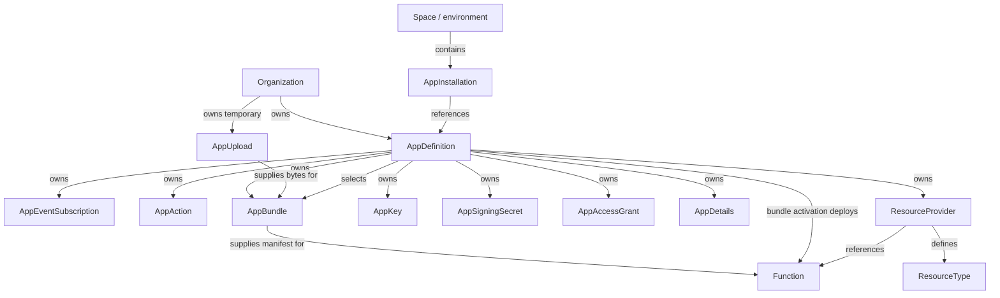
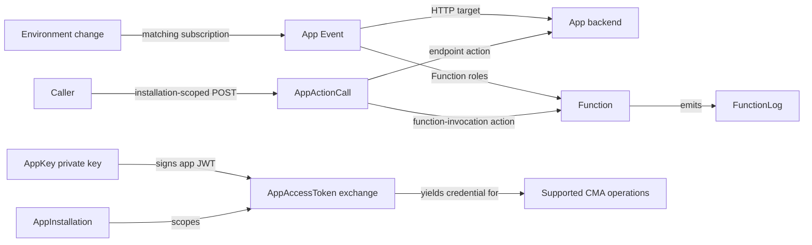

# App Framework resources, APIs, and behavior

The App Framework connects organization-owned app configuration with space/environment
installations, event delivery, action execution, deployment, identity, and external
resources. These concerns share references but have different identities, data shapes,
and lifecycles.

This study describes the Contentful resource model and its public API contracts. It is a
reference for understanding, operating, integrating, and maintaining those contracts
throughout their use and evolution.

## Reading map

- [App configuration and installation](configuration.md)
- [App bundles and Function deployment](deployment.md)
- [App Events: subscriptions, topics, and payloads](events.md)
- [App Actions: definitions, invocation, and outcomes](actions.md)
- [App Identity: keys and access tokens](identity.md)
- [App request signing and verification](request-signing.md)
- [Native external references: providers, types, and resources](native-external-references.md)
- [Functions: runtime, logs, usage, and availability](functions.md)
- [Webhooks: configuration, delivery, and observability](../webhooks.md)

## Scope and evidence

This research covers the public CMA resource families and first-party SDK operations
connected to event subscription, app execution, deployment, identity, distribution, and
observability. It does not assert that undocumented internal APIs are absent, or
inventory every CRUD operation for every entity capable of emitting an event. Coverage
follows each related family's addressing scope, operations, request and response data,
relationships, lifecycle behavior, and operational limits. Source gaps remain explicit
rather than being filled by analogy to another resource.

The [research terminology](../README.md#terminology-and-scope) and [evidence and
redaction conventions](../README.md#evidence-and-redaction) apply throughout this family.

### Source metadata

| Evidence set | Date and scope |
| --- | --- |
| Shared public-documentation review | 2026-09-09; App Framework study pages, with source-specific reviews below. Signing-secret wire research has separate provenance linked below. |
| Aggregate Function usage documentation | 2026-09-10; the [usage reference](functions.md#usage-and-observability) records endpoint and overview differences. |
| Resource Entities display-mapping guide | 2026-09-10; the [mapping reference](native-external-references.md#resourceprovider-resourcetype-and-resource) retains the pinned first-party example. |
| App Parameters and installation size documentation | 2026-09-10; [configuration](configuration.md#appdefinition-and-appinstallation-data) records Secret access and the guide/overview size disagreement. |
| Direct configuration observations | 2026-09-08 (UTC); disposable, uninstalled app configuration, with the experiment scope below. |
| Supplied read-only observations | 2026-09-09 (UTC); existing installations, environment actions, Function discovery and logs, and ResourceType collections. The focused references retain the observed projections and pagination limits. |
| Supplied installation-parameter observations | 2026-09-09 (UTC); one existing installation in a concrete environment, with only `Symbol` declarations. [Configuration](configuration.md#installation-parameter-replacement) records the PUT/read-back comparisons. |

Shared first-party source comparisons use these revisions unless a reference supplies a
different pin:

- [contentful-management.js](https://github.com/contentful/contentful-management.js/tree/883e2b9dc1c76413d5c24e45f74243da699071e4), commit `883e2b9dc1c76413d5c24e45f74243da699071e4`.
- [node-apps-toolkit](https://github.com/contentful/node-apps-toolkit/tree/64fa31b6b2223cd1c8b1798fa540e8aad5e2d319), commit `64fa31b6b2223cd1c8b1798fa540e8aad5e2d319`.
- [create-contentful-app / app-scripts](https://github.com/contentful/create-contentful-app/tree/909e37a3e55a1e5851bdc35f49ac9c5c34b64d4e), commit `909e37a3e55a1e5851bdc35f49ac9c5c34b64d4e`.

The direct configuration probes changed disposable, uninstalled configuration only.
No content was changed, app installed, HTTP event delivered, action invoked, or
Function executed. External-resource resolution was not exercised. The later read-only
study inspected existing configuration and logs without generating executions. The
separate parameter study updated an existing installation and compared its returned
configuration after each request; it did not install or remove an app. None of these
studies establishes end-to-end delivery or availability for another tenant.

Published [configuration limits](configuration.md#appdefinition-and-appinstallation-data)
and [Function availability](functions.md#runtime-and-availability) come from cited
documentation. The
[signing-secret wire evidence](request-signing.md#appsigningsecret-wire-contract-and-sources)
and [direct probe](request-signing.md#direct-cma-observation) retain their separate source
revision and observation date.

## Resource relationships

Ownership, deployment references, and runtime use are distinct relationships. The
following diagram shows structural scope; arrows are labeled so selecting a bundle is
not confused with owning a resource or installing an app.

| Resource family | Addressing and relationship | Lifecycle consequence |
| --- | --- | --- |
| AppDefinition | Organization-owned app with its own ID. | Its shared configuration can affect many installations. |
| AppInstallation | One app definition in one space/environment; addressed by that definition's ID. | Installation is environment configuration, not a copy of the definition. |
| AppEventSubscription, AppDetails, AppSigningSecret, ResourceProvider | Each has one optional singleton address below an app definition. | The parent tuple identifies the address; no collection operation exists for these singletons in the reviewed surface. |
| AppAction, AppBundle, AppKey, AppAccessGrant | Collections below an app definition, with action/bundle IDs, key fingerprints, or grant IDs. | Changing one member is distinct from changing the definition or all installations. |
| AppUpload | Organization-owned temporary artifact, outside the definition subtree. | Its expiry and deletion are separate from the durable bundle created from it. |
| Function | App-scoped runtime capability identified in the deployment manifest; visible through definition and installation routes. | Deployment materializes the Function; no independent create/update/delete Function endpoint is exposed. |
| ResourceType and Resource | Types are configured below ResourceProvider; external records are queried through an environment/type route. | A Resource response describes external content; it does not transfer ownership of that content to CMA. |
| AppActionCall and FunctionLog | Execution and diagnostic data addressed within an installation and action or Function. | These are runtime records, distinct from reusable configuration. |
| AppAccessToken and AppSignedRequest | Generated through an installation-scoped POST. | These yield credentials or headers, not another installed app or mutable configuration object. |

These relationships follow the endpoint and entity sources in the [API
inventory](#api-inventory) and the family-specific contracts in the
[reading map](#reading-map). An app definition owns configuration shared across
installations. Installation selects the
space/environment in which it operates. Subscription changes apply to existing and
future installations. AppInstallation events describe changes to that app's own
installation, not every app installed in the environment. Sources: [App Events][events],
[installation events][installation-events].

Execution connects those structural resources in different ways:

The signing secret authenticates outbound HTTP provenance; the AppKey/JWT exchange
establishes an app's CMA identity. Neither substitutes for the other. See [request
signing](request-signing.md) and [App Identity](identity.md).

## API inventory

Path abbreviations:

- `O = /organizations/{organization_id}`
- `A = O/app_definitions/{app_definition_id}`
- `E = /spaces/{space_id}/environments/{environment_id}`
- `I = E/app_installations/{app_definition_id}`
- `W = /spaces/{space_id}/webhook_definitions/{webhook_id}`

Paths use the CMA host unless marked **upload host**. US hosts are `api.contentful.com`
and `upload.contentful.com`; regional configuration must use the matching API/upload
hosts. An installation is addressed using its app definition ID within the environment.

| Resource or operation | Public methods and paths | Lifecycle / relevance |
| --- | --- | --- |
| AppDefinition | GET/POST `O/app_definitions`; GET/PUT/DELETE `A` | App metadata and selected frontend source/bundle. [SDK][definition-sdk] |
| AppInstallation | GET `E/app_installations`; GET/PUT/DELETE `I` | PUT installs or reconfigures an app. [SDK][installation-sdk] |
| Cross-environment installation discovery | GET `/app_definitions/{app_definition_id}/app_installations?sys.organization.sys.id[in]=...` | Lists installations of an app in an organization; supports space filters. [SDK][installation-sdk] |
| AppEventSubscription | GET/PUT/DELETE `A/event_subscription` | One subscription per definition; PUT upserts; no subscription ID or list operation. [SDK][event-sdk] |
| AppAction | GET/POST `A/actions`; GET/PUT/DELETE `A/actions/{action_id}` | Persistent endpoint or Function action definition. [SDK][action-sdk] |
| Environment action discovery | GET `E/actions`; SDK also supports `/spaces/{space_id}/actions` | Available actions exposed by installed apps. [SDK][action-sdk] |
| AppActionCategory | GET `O/app_actions_categories` | Built-in parameter schemas, read-only. [CMA][categories] |
| AppActionCall | POST `I/actions/{action_id}/calls`; GET same plus `/{call_id}` | Asynchronous execution and structured outcome. [SDK][call-sdk] |
| AppActionCall raw response | GET `I/actions/{action_id}/calls/{call_id}/response` | Executor response, distinct from structured call result. [SDK][call-sdk] |
| Legacy call details | GET `E/actions/{action_id}/calls/{call_id}` | Older SDK polling route, returns webhook-shaped details. [SDK][call-sdk] |
| AppDetails | GET/PUT/DELETE `A/details` | Optional singleton presentation metadata, currently an icon. [SDK][details-sdk] |
| AppUpload | POST `O/app_uploads`; GET/DELETE `O/app_uploads/{upload_id}` on **upload host** | Temporary zip upload. DELETE exists in SDK and succeeded live, although current CMA navigation omits it. [SDK][upload-sdk] |
| AppBundle | GET/POST `A/app_bundles`; GET/DELETE same plus `/{bundle_id}` | Immutable deployment artifact; no update endpoint. [SDK][bundle-sdk] |
| Function | GET `A/functions`; GET same plus `/{function_id}`; GET `I/functions` | Created/deployed through bundles, not standalone Function CRUD. [SDK][function-sdk] |
| FunctionLog | GET `I/functions/{function_id}/logs`; GET same plus `/{log_id}` | Generated execution records; cursor pagination and feature header. [SDK][log-sdk] |
| AppSigningSecret | GET/PUT/DELETE `A/signing_secret` | Symmetric signing secret singleton. [SDK][secret-sdk] |
| AppKey | GET/POST `A/keys`; GET/DELETE `A/keys/{fingerprint}` | Asymmetric app identity key; immutable, no update. [SDK][key-sdk] |
| AppAccessToken | POST `I/access_tokens` | Installation-scoped credential exchange, not durable CRUD. [SDK][token-sdk] |
| AppSignedRequest | POST `I/signed_requests` | Returns signature headers for a frontend request; does not deliver it. [SDK][signed-sdk] |
| AppAccessGrant | GET/POST `A/access_grants`; DELETE same plus `/{grant_id}` | App distribution to other organizations; no update or singleton read established. [CMA][grants] |
| ResourceProvider | GET/PUT/DELETE `A/resource_provider` | Native external references singleton linked to a Function. [SDK][provider-sdk] |
| ResourceType | GET `A/resource_provider/resource_types`; GET/PUT/DELETE same plus `/{resource_type_id}`; GET `E/resource_types` | Resource type identity and display mapping. [SDK][type-sdk] |
| Resource | GET `E/resource_types/{resource_type_id}/resources` | External search/lookup, not management of the external objects. [SDK][resource-sdk] |
| Function usage | GET `O/usages/functions_invocations` | Aggregate usage rather than individual invocation logs. [CMA][usage-aggregate] |

Traditional Webhook resources and their observability endpoints are described in the
[Webhook reference](../webhooks.md). No independent public CRUD resource named
`AppAccess` was identified; AppAccessGrant and AppAccessToken have distinct purposes.

### Transport, envelopes, and collection queries

CMA management requests use HTTPS and an access token. JSON mutation bodies use
`Content-Type: application/vnd.contentful.management.v1+json`; AppUpload sends zip bytes
instead. Management authorization, app-JWT exchange, outbound signing, and access grants
have separate roles; see [App Identity](identity.md), [request signing](request-signing.md),
and [app sharing](configuration.md#appaccessgrant-and-sharing). The CMA reports throttling with 429 and `X-Contentful-RateLimit-Reset` in seconds. An
observed rate or a published default is not an app-specific quota. [CMA
overview][cma-overview], [upload adapter][upload-sdk].

Response `sys` metadata is resource-specific: an AppEventSubscription lacks its own `id`
and `version`, whereas AppDefinition includes both. Generic CMA statements about IDs or
version locking do not override those specific shapes. [Subscription entity][event-entity],
[definition entity][definition-entity].

| Collection surface | Query and response evidence |
| --- | --- |
| AppDefinition, AppInstallation, AppAction, AppBundle, AppKey and other offset collections | The SDK's `CollectionProp` contains `sys.type: "Array"`, `items`, `skip`, `limit`, and `total`. Query support is endpoint-specific; a shared SDK index signature is not proof that every search operator is accepted. [Shared types][common-types], [definition][definition-sdk], [installation][installation-sdk], [action][action-sdk], [bundle][bundle-sdk], [key][key-sdk]. |
| Cross-environment installations | Organization filter `sys.organization.sys.id[in]` plus optional `sys.space.sys.id[in]`; the SDK's `spaceId` query shorthand becomes the latter wire field. [Installation adapter][installation-sdk], [query conversion][query-utils]. |
| Function discovery | Definition and installation collections support `accepts[all]` in their declared query contract. [Function adapter][function-sdk]. |
| External Resource search/lookup | Cursor collection: `items`, `limit`, optional `pages.next`/`pages.prev`, without required `skip` or `total`; query details are in [Native external references](native-external-references.md). [Resource adapter][resource-sdk], [shared types][common-types]. |
| FunctionLog | Declared request keys include `limit`, `pageNext`, and `pagePrev`, plus creation-time bounds. [Observed log collections](functions.md#function-invocation-context-and-logs) returned `sys`, `pages`, and summary `items`, without ordinary offset metadata. The adapter's generic offset-collection annotation differs from that wire projection. [Log adapter][log-sdk], [log reference][logs]. |

The CMA also documents a general `cursor=true` mechanism. Its availability, filter
support, and pagination defaults must be taken from the endpoint in use. SDK `select`
normalization appends `sys` when its helper considers it absent; this is client request
rewriting, not server response behavior. [CMA pagination][cma-overview], [query
conversion][query-utils].

## Identity, mutation, and concurrency

Version policy must remain resource-specific. The SDK adds `X-Contentful-Version:
sys.version ?? 0` on AppDefinition PUT, but not DELETE. It adds no version header for
AppInstallation, AppAction, AppDetails, AppEventSubscription, AppBundle,
AppSigningSecret, or AppKey operations. ResourceProvider/ResourceType accept
caller-supplied headers without adding a version automatically. This is SDK behavior,
not a general server concurrency guarantee. The subscription's ignored stale header is
the specific live result. [Definition adapter][definition-sdk], [installation
adapter][installation-sdk], [event adapter][event-sdk], [provider
adapter][provider-sdk], [type adapter][type-sdk].

### Identity and recoverable data

AppEventSubscription and AppDetails are addressed by the organization/app definition
tuple. AppAction and AppBundle add their own system ID; AppKey uses its fingerprint. An
installation's identity additionally includes space and environment. Subscription
identity does not imply that all singletons lack `sys.id`: ResourceProvider has an
explicit provider ID. Parent links in responses describe the addressed relationship; a
contradictory link cannot establish another resource's identity. [Subscription
entity][event-entity], [details entity][details-entity], [action entity][action-entity],
[bundle entity][bundle-entity], [key adapter][key-sdk].

Read responses have different reconstruction limits. Subscription target/topics are
returned configuration. A signing secret read returns only a suffix; a key read does not
recover private key material. Bundle metadata does not reconstruct the upload archive.
Declared Secret installation parameters have [credential-dependent
redaction](configuration.md#appdefinition-and-appinstallation-data). Environment action
and installation Function discovery can return reduced projections, as their focused
references describe.
Call status and log records are generated runtime data. These differences remain
relevant to backup, export, reconciliation, and drift analysis regardless of the client
managing them.

### Replacement, deletion, and concurrency

Mutation and omission behavior remains resource-specific. The [subscription
observations](events.md#observed-wire-behavior) and [App Action
observations](actions.md) record different required fields, replacement rules, and
validation results. The [installation parameter
experiment](configuration.md#installation-parameter-replacement) distinguishes
whole-field omission, required-field validation, and map replacement for its tested
declarations. These results do not establish a common App Framework merge policy.

A child GET 404 after parent deletion establishes inaccessibility through that address,
not an internal cascade-storage policy. A 403 is an authorization or availability
failure, not evidence of absence. A configuration write can succeed without an action
being invocable or a bundle being activated.

The reviewed surface exposes separate upload, bundle creation, activation, action
configuration, and subscription configuration requests. No cross-resource transaction
was established. Delivery retries, management request retries, and SDK call polling are
separate behaviors.

## Unresolved behavior and source disagreements

A top-level Marketplace lookup shape, `GET /app_definitions?sys.id[in]=...`, has no
supporting published contract or pinned first-party adapter in the reviewed sources. Its
behavior remains unverified and it is excluded from the public API inventory. Definition
lookup and accepting Marketplace installation terms are separate operations; the
verified installation header is documented in [app configuration](configuration.md).

Each focused reference records source disagreements and unverified behavior beside the
affected resource.

[events]: https://www.contentful.com/developers/docs/extensibility/app-framework/app-events/
[installation-events]: https://www.contentful.com/developers/changelog/app-installation-events/
[event-sdk]: https://github.com/contentful/contentful-management.js/blob/883e2b9dc1c76413d5c24e45f74243da699071e4/lib/adapters/REST/endpoints/app-event-subscription.ts
[event-entity]: https://github.com/contentful/contentful-management.js/blob/883e2b9dc1c76413d5c24e45f74243da699071e4/lib/entities/app-event-subscription.ts
[definition-sdk]: https://github.com/contentful/contentful-management.js/blob/883e2b9dc1c76413d5c24e45f74243da699071e4/lib/adapters/REST/endpoints/app-definition.ts
[installation-sdk]: https://github.com/contentful/contentful-management.js/blob/883e2b9dc1c76413d5c24e45f74243da699071e4/lib/adapters/REST/endpoints/app-installation.ts
[action-sdk]: https://github.com/contentful/contentful-management.js/blob/883e2b9dc1c76413d5c24e45f74243da699071e4/lib/adapters/REST/endpoints/app-action.ts
[action-entity]: https://github.com/contentful/contentful-management.js/blob/883e2b9dc1c76413d5c24e45f74243da699071e4/lib/entities/app-action.ts
[categories]: https://www.contentful.com/developers/docs/references/content-management-api/app-action-categories/get-app-action-categories/
[call-sdk]: https://github.com/contentful/contentful-management.js/blob/883e2b9dc1c76413d5c24e45f74243da699071e4/lib/adapters/REST/endpoints/app-action-call.ts
[details-sdk]: https://github.com/contentful/contentful-management.js/blob/883e2b9dc1c76413d5c24e45f74243da699071e4/lib/adapters/REST/endpoints/app-details.ts
[details-entity]: https://github.com/contentful/contentful-management.js/blob/883e2b9dc1c76413d5c24e45f74243da699071e4/lib/entities/app-details.ts
[upload-sdk]: https://github.com/contentful/contentful-management.js/blob/883e2b9dc1c76413d5c24e45f74243da699071e4/lib/adapters/REST/endpoints/app-upload.ts
[bundle-sdk]: https://github.com/contentful/contentful-management.js/blob/883e2b9dc1c76413d5c24e45f74243da699071e4/lib/adapters/REST/endpoints/app-bundle.ts
[bundle-entity]: https://github.com/contentful/contentful-management.js/blob/883e2b9dc1c76413d5c24e45f74243da699071e4/lib/entities/app-bundle.ts
[function-sdk]: https://github.com/contentful/contentful-management.js/blob/883e2b9dc1c76413d5c24e45f74243da699071e4/lib/adapters/REST/endpoints/function.ts
[log-sdk]: https://github.com/contentful/contentful-management.js/blob/883e2b9dc1c76413d5c24e45f74243da699071e4/lib/adapters/REST/endpoints/function-log.ts
[secret-sdk]: https://github.com/contentful/contentful-management.js/blob/883e2b9dc1c76413d5c24e45f74243da699071e4/lib/adapters/REST/endpoints/app-signing-secret.ts
[key-sdk]: https://github.com/contentful/contentful-management.js/blob/883e2b9dc1c76413d5c24e45f74243da699071e4/lib/adapters/REST/endpoints/app-key.ts
[token-sdk]: https://github.com/contentful/contentful-management.js/blob/883e2b9dc1c76413d5c24e45f74243da699071e4/lib/adapters/REST/endpoints/app-access-token.ts
[signed-sdk]: https://github.com/contentful/contentful-management.js/blob/883e2b9dc1c76413d5c24e45f74243da699071e4/lib/adapters/REST/endpoints/app-signed-request.ts
[grants]: https://www.contentful.com/developers/docs/references/content-management-api/app-access-grants/query-access-grants-of-a-app-definition/
[provider-sdk]: https://github.com/contentful/contentful-management.js/blob/883e2b9dc1c76413d5c24e45f74243da699071e4/lib/adapters/REST/endpoints/resource-provider.ts
[type-sdk]: https://github.com/contentful/contentful-management.js/blob/883e2b9dc1c76413d5c24e45f74243da699071e4/lib/adapters/REST/endpoints/resource-type.ts
[resource-sdk]: https://github.com/contentful/contentful-management.js/blob/883e2b9dc1c76413d5c24e45f74243da699071e4/lib/adapters/REST/endpoints/resource.ts
[definitions]: https://www.contentful.com/developers/docs/references/content-management-api/app-definitions/
[logs]: https://www.contentful.com/developers/docs/references/content-management-api/function-logs/
[usage-aggregate]: https://www.contentful.com/developers/docs/references/content-management-api/usage/get-usage-aggregated/
[cma-overview]: https://www.contentful.com/developers/docs/references/content-management-api/overview/
[definition-entity]: https://github.com/contentful/contentful-management.js/blob/883e2b9dc1c76413d5c24e45f74243da699071e4/lib/entities/app-definition.ts
[common-types]: https://github.com/contentful/contentful-management.js/blob/883e2b9dc1c76413d5c24e45f74243da699071e4/lib/common-types.ts
[query-utils]: https://github.com/contentful/contentful-management.js/blob/883e2b9dc1c76413d5c24e45f74243da699071e4/lib/adapters/REST/endpoints/utils.ts
